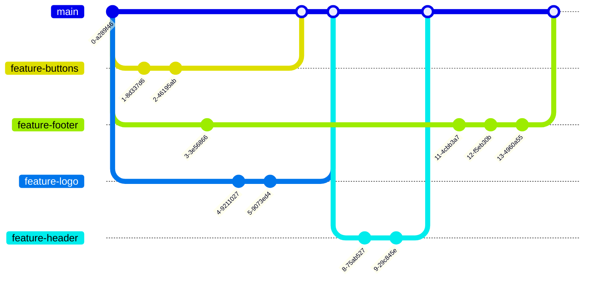

# Managing Merge Conflicts

## Learning Objectives
- [ ] Commit different changes to the same line
- [ ] Resolve the merge conflicts that occur
- [ ] Feature branch from main on a shared repo

## Requirements

### 1. Create and resolve merge conflicts

### 2. Reduce merge conflicts with feature branching

## Acceptance Criteria

- [ ] I have created a merge conflict
- [ ] I have resolved this conflict
- [ ] I have created a small scoped feature branch on a shared repo
- [ ] I have merged this feature branch to main
